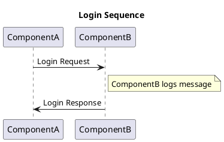
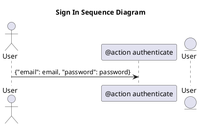
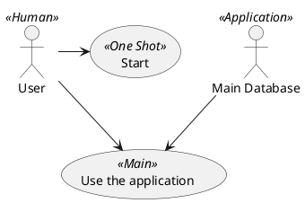

## Prueba Docs

Esta es la página principal de documentación.


### Diagrama PlantUML
Diagrama 1:



```plantuml id="myDiag" format="svg"
  Goofy ->  MickeyMouse: calls
  Goofy <-- MickeyMouse: responds
```

#### Diagrama 2:



### Diagrama PlantUML (avanzado)


### Diagrama PlantUML (importado)
```plantuml format="svg" source="docs/diagrama1.puml"
```

### Configuración de MkDocs (mkdocs.yml)
```
  site_name: 'prueba-docs'
  repo_url: https://github.com/ucbg6/prueba-docs/
  
  # Indica que la documentación se encuentra 
  # en el mismo directorio que este fichero
  docs_dir: '.'

  nav:
   - Pagina principal: README.md
   - Backstage: docs/index.md
   - Otra pagina: docs/page2.md

  plugins:
   - techdocs-core
   - same-dir
  # Es necesario agregar este plugin para que MkDocs
  # permita esta configuración, de lo contrario dará error

  # pip3 install mkdocs-same-dir
  
```


